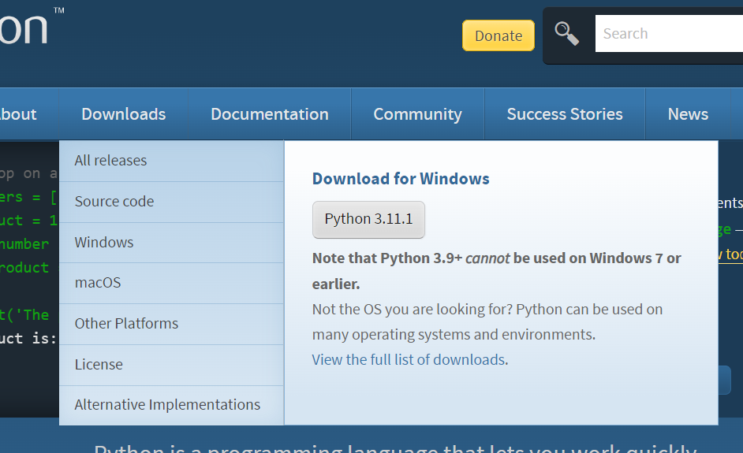
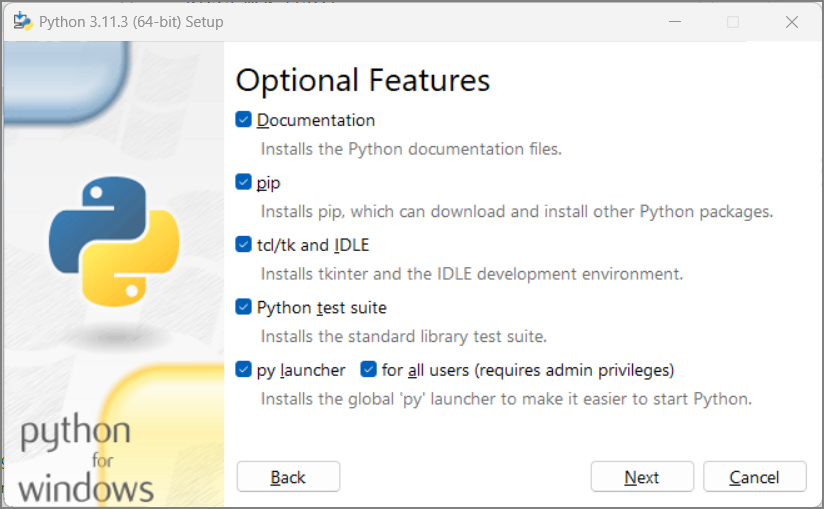
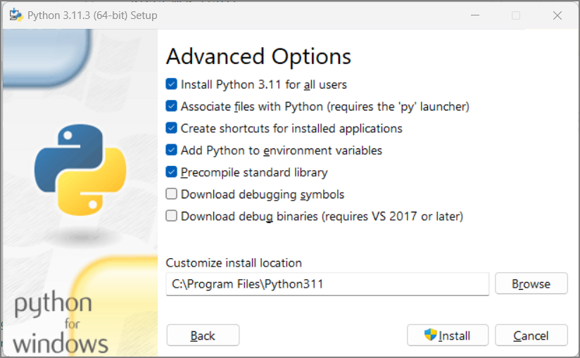
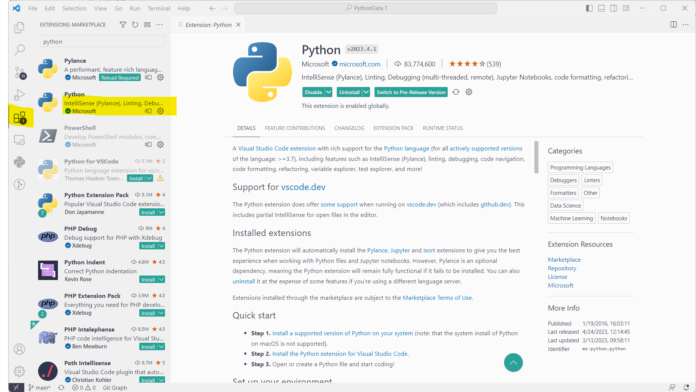
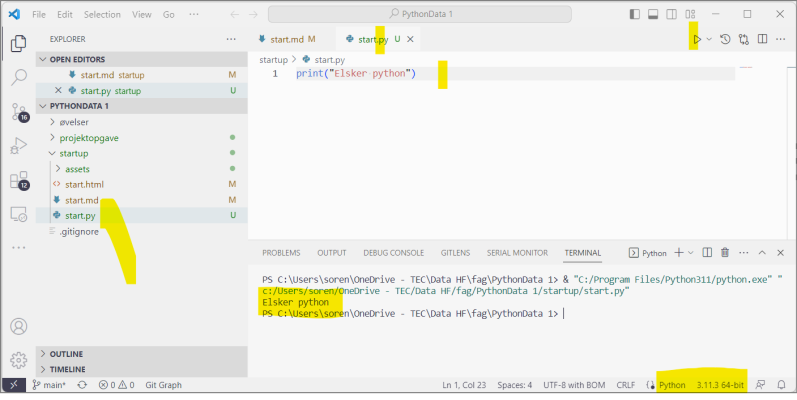

 
---
# pandoc -s --mathjax -t revealjs start.md -o start.html --slide-level=2 --embed-resources --standalone
title: Python
author: Søren Magnusson, TEC
date: Februar 2023
theme: white
slide-level: 2 
...

_-- et valgfag på TEC_

# Python

Med fokus på datastrukturer

. . . 

men hvad mener jeg med datastrukturer?

## Datastrukturer er

- lister `[1,2,'tre', ...]`
- tupler `(1,2,'tre')`
- dictionaries `{key1: value1, 'key2': 'value2'}`
- mængder `set`

## og - i høj grad - kombinationer af disse

- Lister af dicts
- Dicts med lister
- Lister af lister af dicts med lister

# Men Aller-Først, 

__*installering*__

## python.org

Download seneste version

---

Check "`Add python.exe to PATH`"  
Og vælg "`Customize installation`"

---

Vælg alt  
og tryk "`Next`"

---

Check "`Install Python 3-11 for all users`"  
og tryk på "`Install`"-

---

vent...  

# Editor miljø

Man kan f.eks. vælge et af følgende, men der da også andre:

  1.  VisualStudio Code [_Min favorit_]
  1.  PyCharm
  1.  Idle ("indbygget")

## VS Code extensions

## python miljø

* Alle filer med `.py` er python filer
* Der er syntaks highlight og syntaks check med pylance
* Python scriptet udføres med at trykke på trekanten/pilen øverst til højre
* output fra print kommer i konsol panelet
* Man kan vælge fortolker-opsætning (hvis man har flere), nederst til højre

# Opgaver

## Kildekode til opgaver, med git

* bliv meldt ind, i lærerens github team
  * Hvad er dit brugernavn på github?
* lav en `fork` af https://github.com/TEC-Prog-Stud/PythonData-1
* lav en klon på din computer
  * `git clone https://github.com/<dit-brugernavn ... nej ikke "dit-brugernavn" ... >/PythonData-1`

# Og så i gang...