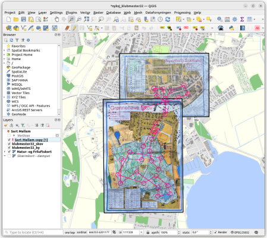

# Analyser løbe-data fra GPS data

Jeg prøver at lære at løbe orienteringsløb.  
Derfor træner jeg, med stor fornøjelse, i skoven, et par gange om ugen.
Når man "løber" orienteringsløb, skal man både løbe hurtigt, løbe i vanskeligt terræn og finde vej hen til posterne. Derfor kommer jeg tit ned i langsommere tempo. Jeg går faktisk en stor del af vejen.
Jeg vil gerne analysere min løbetur, ud fra data fra mit GPS løbe ur. Et Garmin forerunner 235.

Se opgaven i [O-run_analysis.ipynb](O-run_analysis.ipynb)

_-vh Søren Magnusson_