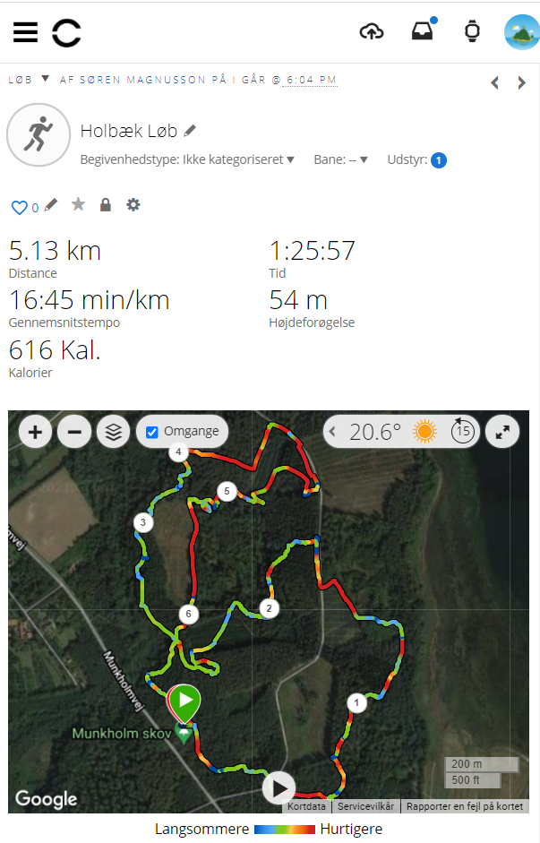
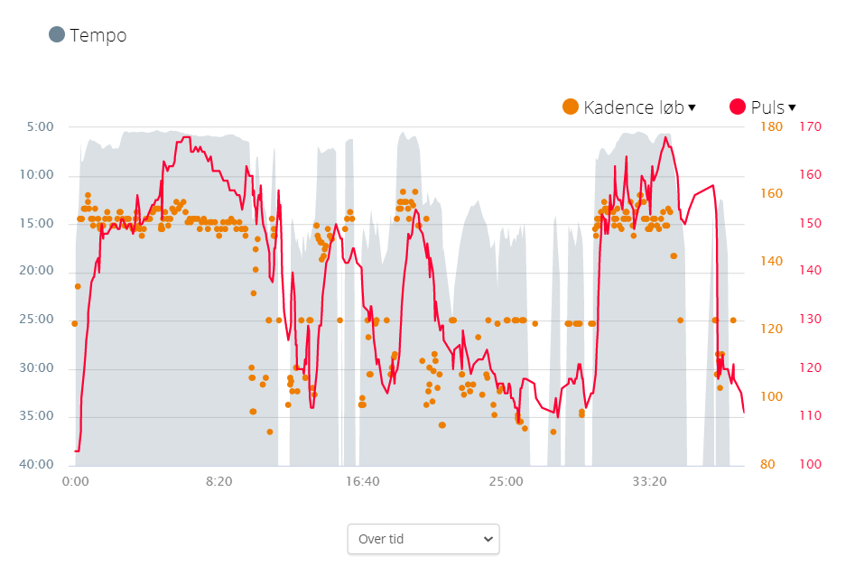
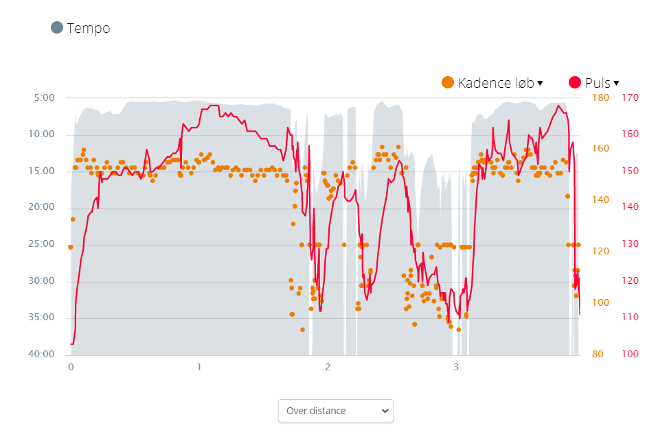

# Analyser løbe-data fra GPS data

Jeg prøver at lære at løbe orienteringsløb.  
Derfor træner jeg, med stor fornøjelse, i skoven, et par gange om ugen.
Når man "løber" orienteringsløb, skal man både løbe hurtigt, løbe i vanskeligt terræn og finde vej hen til posterne. Derfor kommer jeg tit ned i langsommere tempo. Jeg går faktisk en stor del af vejen.
Jeg vil gerne analysere min løbetur, ud fra data fra mit GPS løbe ur. Et Garmin forerunner 235.

Til denne opgave er vedlagt data fra to løbeture i forskellige formater. Se mappen `data`.

Jeg vil gerne have en analyse af hvilke dele af turen der foregår i løb, hvilke i gang, og hvornår jeg står helt eller næsten stille.

Dette vil jeg gerne have opgjort efter tid og opgjort efter afstand.
Se diagrammerne her under:

Som man kan se på diagrammerne herover, er mit tempo i løb sjældent bedre end 5 minutter pr. kilometer (5 min/km). Når jeg kommer ned i gang er tempoet omkring 15 min/km. Når jeg står stille er tempoet teoretisk uendelige minutter pr. kilometer. 

Hvis vi vælger nogen pragmiske grænseværdier kan løb være under 13 min/km. Gang fra 13 min/km til 50 min/km. Stilstand er alt over 50 min/km.

Til at læse `gpx`-filer, kan man bruge python librari'et [gpxgy](https://pypi.org/project/gpxpy/).
Eller noget andet efter behov, se f.eks. [stackoverflow og gpx i python](https://stackoverflow.com/questions/11105663/how-to-extract-gpx-data-with-python). Eller prøv selv på google.

Hvis der skal grafer på, ... så kommer forhåbentlig til det i næste uge.

_-vh Søren Magnusson_